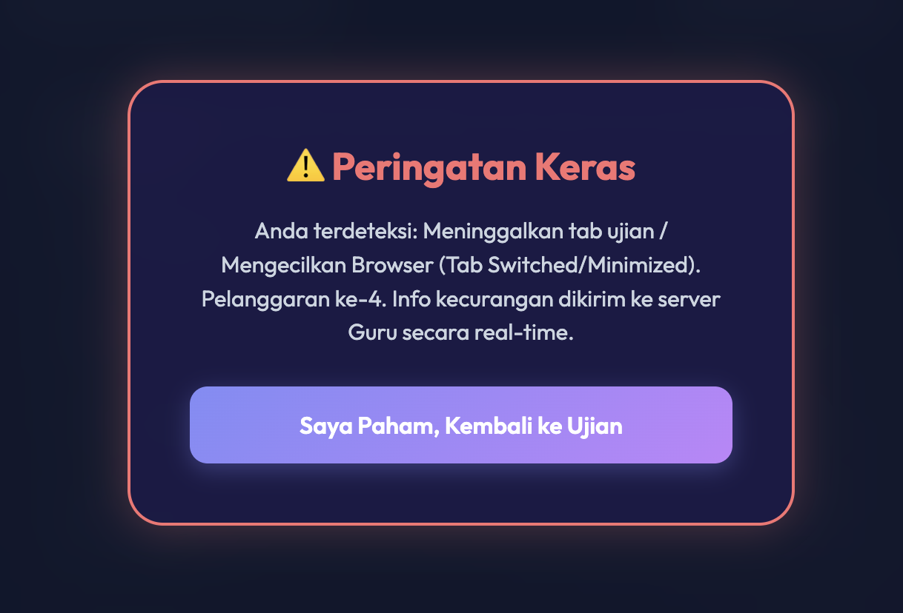
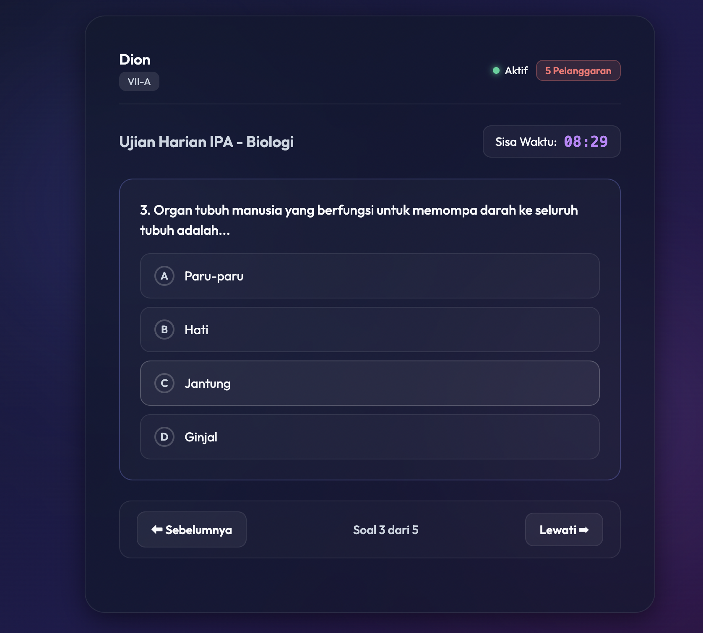

# Secure CBT Online



## Dedication
This project is dedicated to my friend Pipit Haryadi, a teacher at SMP Negeri 3 Wates. He told me that his students often cheat during CBT-based online exams. While there are many strict applications on the market, most of them are paid. I created this free solution with a simple web application to detect cheating events such as opening a new tab, minimizing the browser, taking screenshots, using split screen, and overlay applications. Meanwhile, teachers can monitor their students live and lock the profiles of those who commit cheating during the exam.

## Technology Stack
- **Frontend**: Vanilla HTML, CSS, and JavaScript
- **Backend**: Node.js with Express.js
- **Database**: Local JSON Files (File-based database)

## Cheating Detection Techniques
- **Page Visibility API**: Detects if a student opens a new tab or minimizes the browser window.
- **Window Blur & Focus Events**: Detects if a student uses a split screen, overlay applications, or clicks outside the exam browser.
- **Keydown Listeners**: Prevents common screenshot and copy-paste keyboard shortcuts.
- **Context Menu Block**: Disables right-click to prevent copying questions or inspecting elements.

## How to Deploy to Vercel & Setup Database
1. Push this project repository to your GitHub account. (Note: Ensure sensitive data like `data/data_siswa.json` and `data/data_guru.json` are **ignored** and not committed, while `data/soal/` can be safely committed).
2. Go to [Vercel](https://vercel.com/) and sign in with your GitHub account.
3. Click on **Add New...** > **Project** and import your GitHub repository.
4. Leave the build settings as default and click **Deploy**.

### Upstash KV Setup & Data Migration
Since this project handles sensitive student credentials, we do not commit the `data/` folder to GitHub. Therefore, the deployed Vercel app will initially have an empty database. We use **Upstash Redis** (Vercel KV) to securely store our data.

1. In your Vercel Project Dashboard, navigate to the **Storage** tab.
2. Select **Upstash for Redis** and connect it to your project.
3. Go to the **.env.local** section of your Upstash database in Vercel and copy the `KV_REST_API_URL` (or `UPSTASH_REDIS_REST_URL`) and `KV_REST_API_TOKEN`.
4. Open the `migrate.js` file in your local project and paste the URL and Token.
5. Run the migration script locally to push your local JSON data to the Vercel KV database:
   ```bash
   node migrate.js
   ```
6. Your Vercel app is now securely connected to the Upstash database and ready for login!

## Screenshots

### Kelola Ujian


### Live Monitoring


### Halaman Soal

